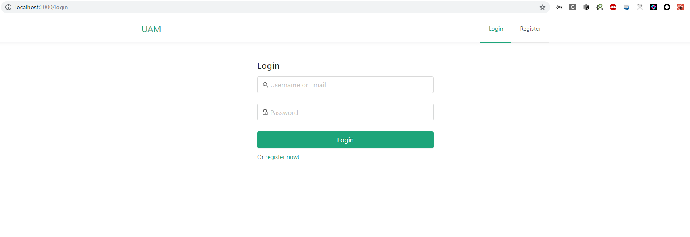
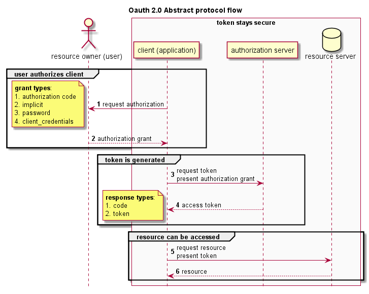
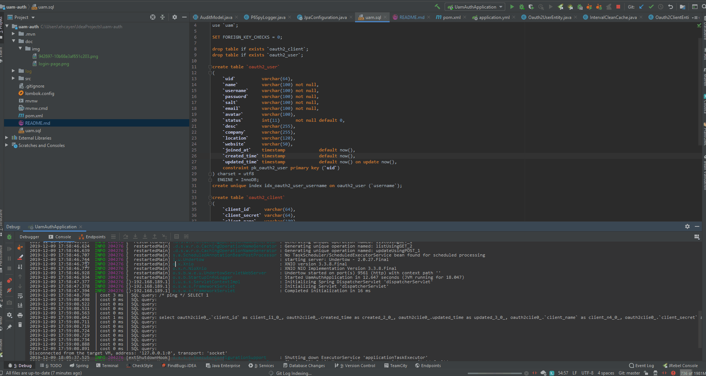

# UAM-Auth




## UML Diagram




## Steps to Setup the Spring Boot Back end app

1. Clone the application 

```shell script
git clone https://github.com/barudisshu/UAM-Auth
cd UAM-auth
```

2. Create MySQL database

```shell script
create database uam
```

3. Change MySQL username and password

- open `src/main/resources/application.yml` file.
- change `spring.datasource.username` and `spring.datasource.password` properties as per your mysql installation

4. Run the app

You can run the spring boot app by typing the following command -

```shell script
mvn spring-boot:run
```

The server will start on port `9561`.

You can also package the application in the form of a `jar` file and then run it like so -

```shell script
mvn package
java -jar target/uam-0.0.1.jar
```

## Steps to Setup the React Front end app

1. Clone the application

```shell script
git clone https://github.com/barudisshu/UAM-React
cd UAM-React
```

2. Then type the following command to install the dependencies and start the application -

```shell script
npm install && npm start
```

the front-end server will start on port `3000`.

## Usage

Once the back end app launch. open browser [http://localhost:9561/swagger-ui.html](http://localhost:9561/swagger-ui.html) the api message ready for adjusting.


